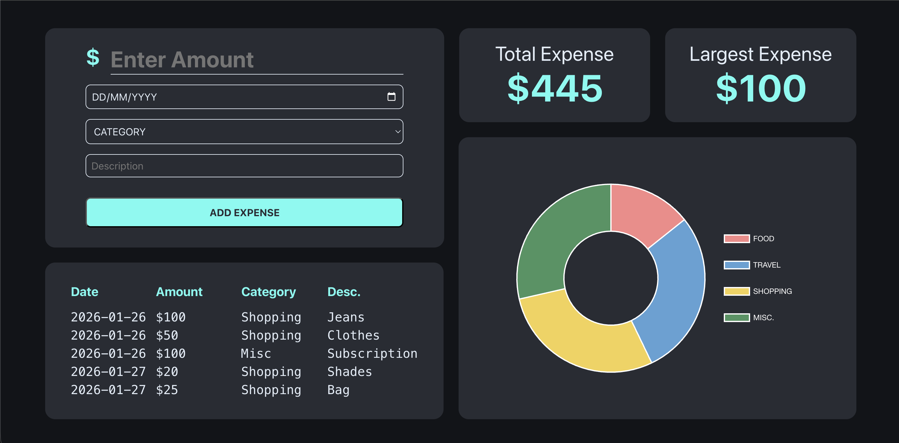

# 💰 Finance Tracker

[](https://react.dev/)
 
[](https://www.chartjs.org/)
 
[](https://developer.mozilla.org/en-US/docs/Web/JavaScript)
 
[](https://sass-lang.com/)


**Finance Tracker** is a modern ReactJS application that helps you track, analyze, and visualize your personal expenses in real time 📊. With interactive charts and instant updates, managing your finances becomes simple and intuitive.

## ✨ Features

- 🧾 **Expense Input**: Add expenses with amount, date, type, category, and description  
- ⏱️ **Real-Time Updates**: No page reloads required  
- 📊 **Visual Analytics**: Interactive charts powered by Chart.js  
- 📌 **Recent Expenses**: View your last 5 recorded expenses  
- 💸 **Largest Expense**: Quickly identify your highest spend  
- 🧮 **Total Expenses**: Track overall spending at a glance  

## 🚀 Live Demo

No installation needed – it's 100% online!

Try it out here 👉 [Finance Tracker by Faraaz Ansari](https://thefaraazansari.github.io/finance-tracker/)

## 📸 Screenshot



## ⚙️ Installation

Follow these steps to run the project locally:

To install node_modules and all necessary dependencies

```bash
npm i
```
```bash
npm i react-chartjs-2 chart.js
```

- `react-chartjs-2`: This is the npm package for integrating Chart.js with React. It provides React components for Chart.js, making it easier to use Chart.js within a React application.

- `chart.js`: This is the Chart.js library, a popular JavaScript library for creating interactive and visually appealing charts and graphs. It is used for rendering charts in the Finance Tracker project.

To start the development server

```bash
npm start
```

Open `[http://localhost:3000]` to view it in your browser.

---
 
Made with ❤️ by **Faraaz Ansari**
